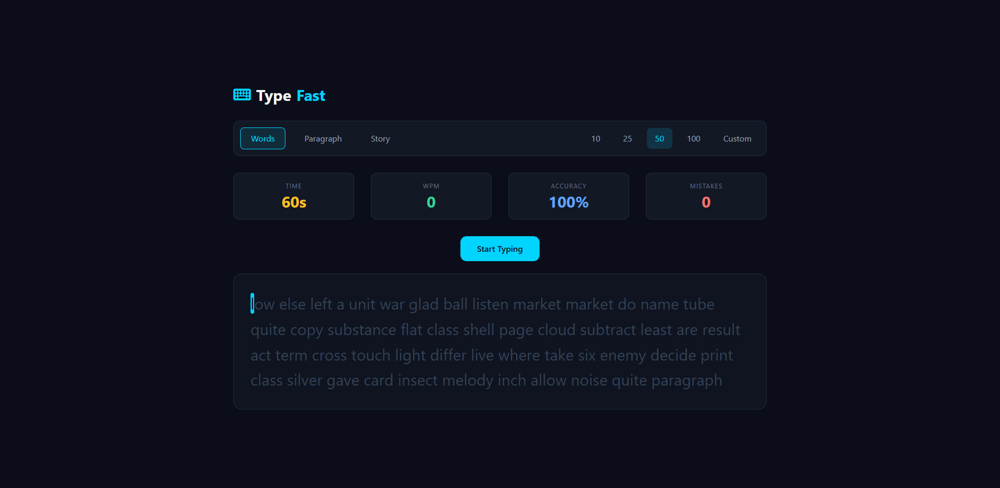
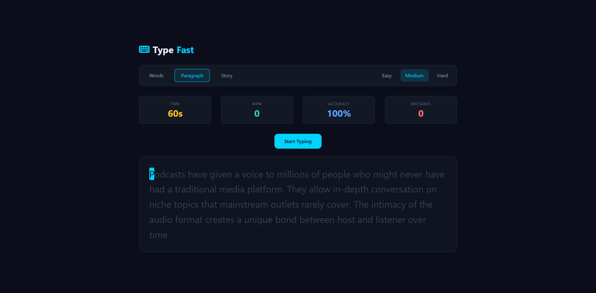
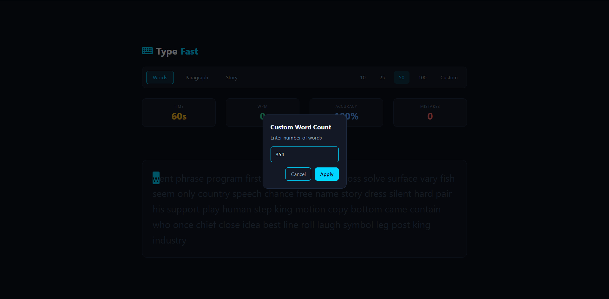
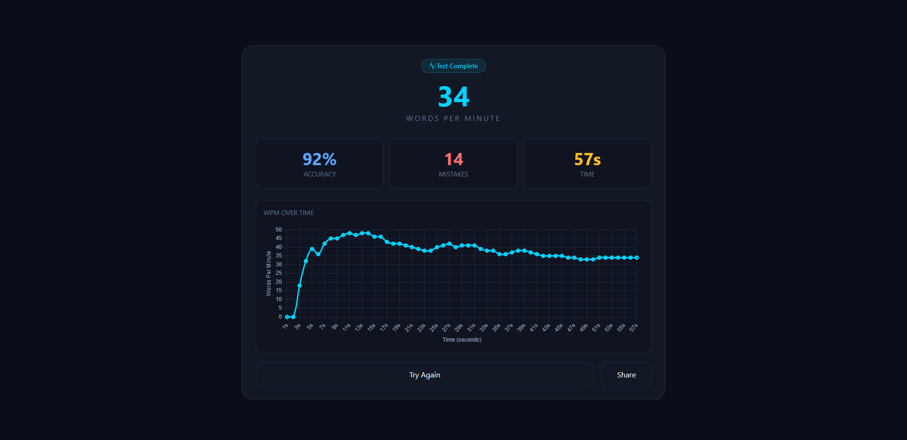

# TypeFast (Typing Speed Tester)

A typing speed test web built with React. Pick a mode, start typing and see how fast you actually are.

## What it does
* Tests yout typing speed in WPM (words per minute)
* Three modes: random words, paragraphs, and AI generated stories
* Paragraph mode has esay/ medium/ hard difficulty levels
* Live stats while you type --> WPM, Accuracy, Mistakes, Time
* Result screen with a wpm-over-time chart so you can see if you warmed up or slowed down 
* Keyboard sound on every keypress
* Share your result or copy it to clipboard

## Modes
- Words 
    You choose how many: 10, 25, 50, 100 or a custom number up to 1000. Good for pure speed practice.
- Paragraph
    Three difficulty levels:
    -- Easy: short sentences, everyday vocabulary
    -- Medium: longer sentences, more complex topics
    -- Hard: academic and technical language philosophy, science, economics
- Story 
    Generates a fresh story using the Gemini AI API every time. Pick horror, funny or adventure. Since its AI generated. you get something different on every attempt.

## Tech used
* React (with hooks)
* Tailwind CSS v4 with custom design tokens
* Chart.js + react-chartjs-2  for the WPM graph
* Google Gemini API for story generation 
* ludide React for icons
* Vite

## Getting started
* git clone https://github.com/meAtmuna/typing-speed-tester.git
* cd typing-speed-tester
* npm install

You need a Gemini API key for the story mode.
Create a .env file in the root:

* VITE_GEMINI_API_KEY = your_api_key_here

You can get a free key at https://aistudio.google.com
Then start the dev server:

* npm run dev

## Screenshot

## Whats coming 
This project still being worked on. Some feature I plan to add:
* Custom timer let the user pick 30, 60 or 120 seconds instead of always 60
* Personal best tracking and leaderboard
* Option to turn the keyboard sound on/off like Settings Option 
* Responsive design
* User authentication (login / signup)
