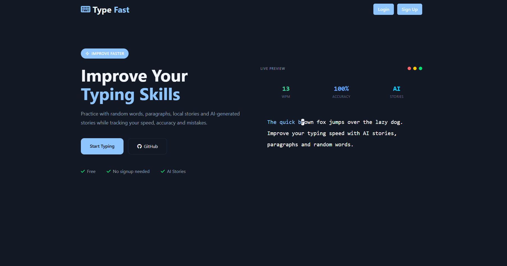
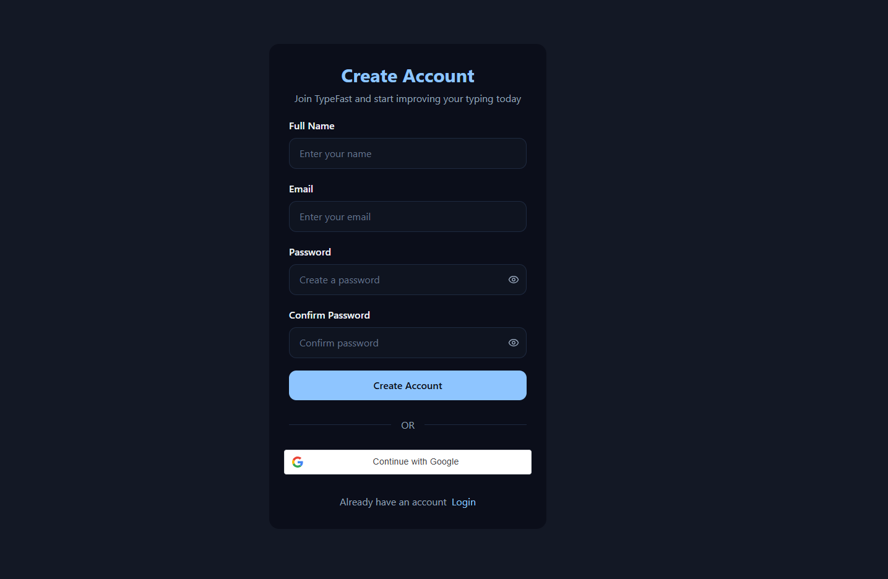
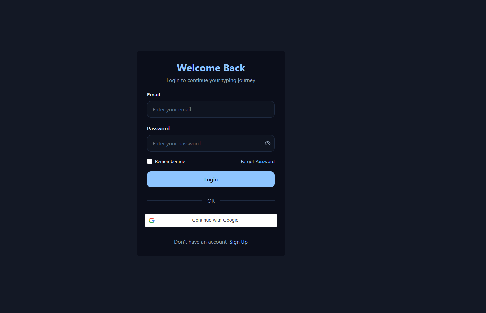
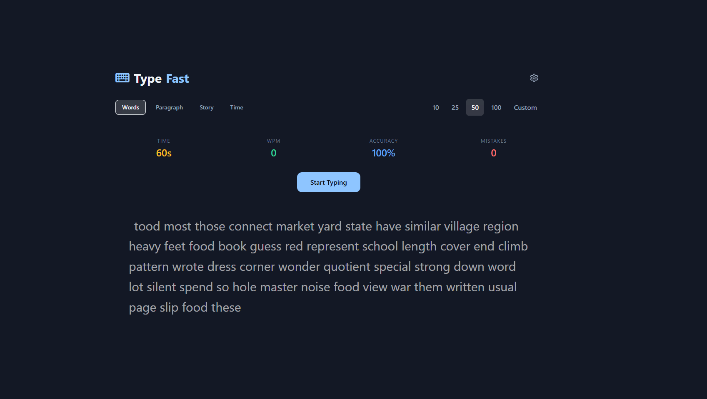
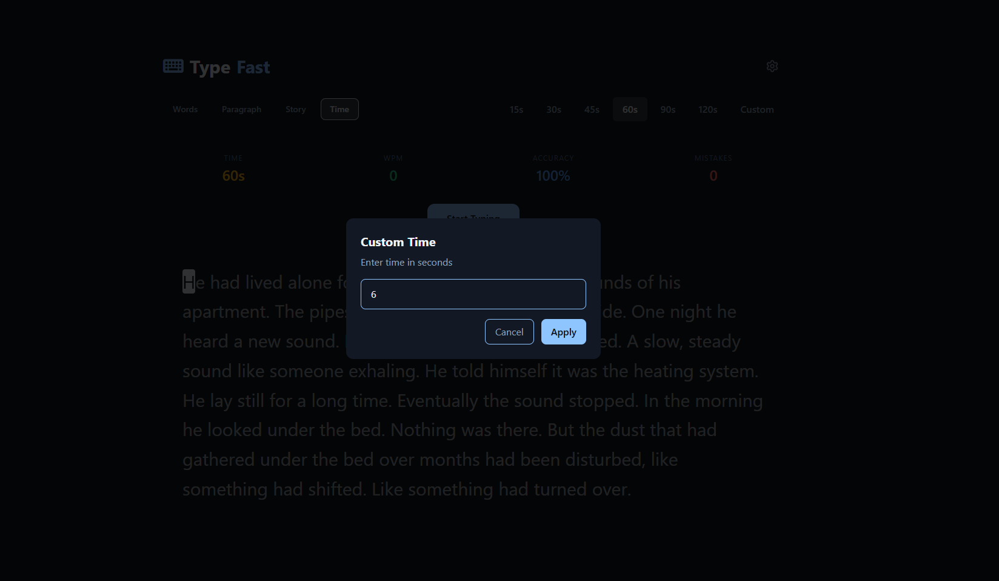
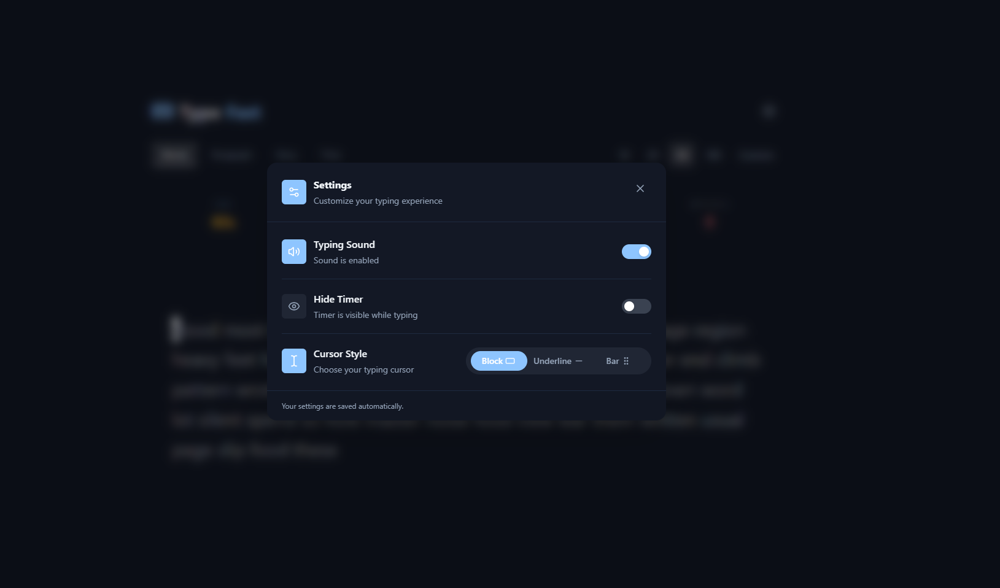
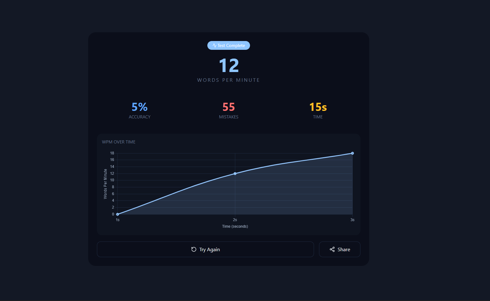

# TypeFast (Typing Speed Tester)

TypeFast is a simple typing speed tester built wiht React. You can practice with random words, paragraph, or stories and see your typing speed, accuracy, mistakes, and time while you type. Pick a mode, start typing and see how fast you actually are.

I built this project to practice React, frontend developmnet, APIs, and backend authentication.

## What it does
* Tests yout typing speed in WPM (words per minute)
* Three typing modes: Words, paragraphs, and Stories
* Choose between 10, 25, 50, 100 or custom number of words
* Custom word count up to 1000 words
* Paragraph mode with esay/ medium/ hard difficulty levels
* Story mode with Horror, Funny , and Adventure categories
* AI-generatd stories using the Gemini API 
* Live WPM, Accuracy, Mistakes, and Time stats
* Pause and resume the typing test
* Custom timer
* WPM history chart after fininshing  a test
* keyborad sound while typing
* Settings for keyboard sound , timer visbility, and cursor style
* Login an signup system
* Password visibility toggle
* JWT-based authentication
* User data stored in MongoDB
* Result screen after completing a test

## Typing Modes
- Words 
    Practice wiht random words
    You can choose:
    * 10
    * 25
    * 50
    * 100
    * custom amount (up to 1000 words)
    This mode is useful when you just want to focus on typing speed.

- Paragraph
    Practice wiht different difficulty levels:
    * Easy -  simple sentences and everyday English
    * Medium -  longer sentences and slightly harder vocabulary
    * Hard - more complex topics and vocabulary

- Story 
    Story mode gvies you longer content to type.
    There are local story categories:
    * Horror
    * Funny
    * Adventure
    There is also AI Story option. You can select a category and TypeFast generates a new story using thte Gemini API.

- Timer
    You can choose different test durations from the time selector.
    You can also enter a custom time in seconds.
    The test can be paused and resumed whenever you want.

- Settings
    TypeFast includes a small settings panel where you cna change: 
    * Keyboard sound on/off
    * Show or hide the timer
    * Typing cursor style 

- Results
    After completing a test, TypeFast shows your result including:
    * WPM
    * Accuracy
    * Mistakes
    * WPM history
    The WPM history is displayed as a chart so you can how your speed changed during the test.

- AUthentication
    TypeFast also has a basic authentication system.
    * Create an account
    * Log in
    * Show or hide their password
    * Stay logged in using a JWT token
    * Store basic user information locally
    The backend handles authentication and passwords are hashed using bcrypt before being stored in the database.

## Tech used
### Frontend
* React
* React Router
* Tailwind CSS v4
* Chart.js
* react-chartjs-2 
* ludide React
* Vite
* Axios

### Backend
* Node.js
* Express.js
* MongoDB
* Mongoose
* bcryptjs 
* JSOM Web Token (JWT)
* CORS
* dotenv

### API
* Google Gemini API for AI-generted stories

## Getting started
* git clone https://github.com/meAtmuna/typing-speed-tester.git
* cd typing-speed-tester
* npm install

### Gemini API
Story mode uses the Google Gemini API.

Create a .env file in the project root:

* VITE_GEMINI_API_KEY = your_api_key_here

You can get a Gemini API key from Google AI Studio:https://aistudio.google.com

### Backend setup
Go to the backend folder:
cd backend
install the backend dependecies:
npm install

Create a .env file inside the backend folder:
PORT=5000
MONGO_URI=your_mongodb_connection_string JWT_SECRET=your_jwt_secret 

Then start the backend:
npm run dev

Go back to the main project folder and start the frontend:

npm run dev

The fonrtend will run on the Vite development server and the backend will run on port 5000.

## Screenshot

## Whats coming 
This project still being worked on. Some feature I want to add:
* Personal best tracking
* Leaderboard
* Better user profiles
* Saving typing results to the database
* More typing content
* More customization options
* Forgot password functionality
* Responsive design
* Google login
* More detailed typing statistics

## Why I built this

I wanted to build somethiing where I could practice React and also learn how a frontend connects with a real backend.

while building TypeFast, I worked with React State an hooks, API requests, authentication, MongoDB, JWT, AI APIs and reusable components. 

More features will be added  as I continue working on the project.

