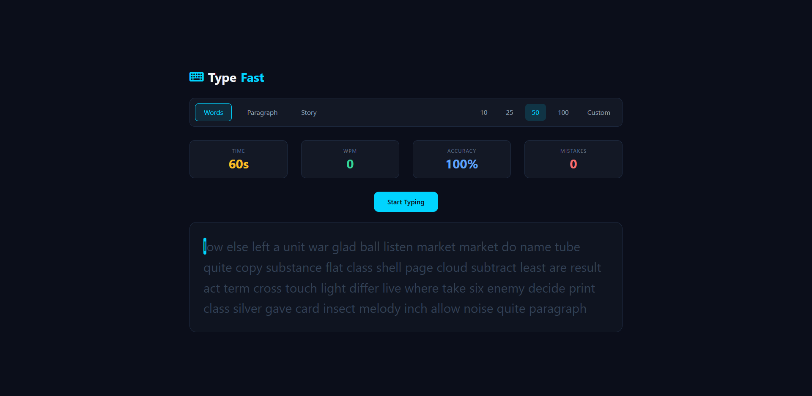
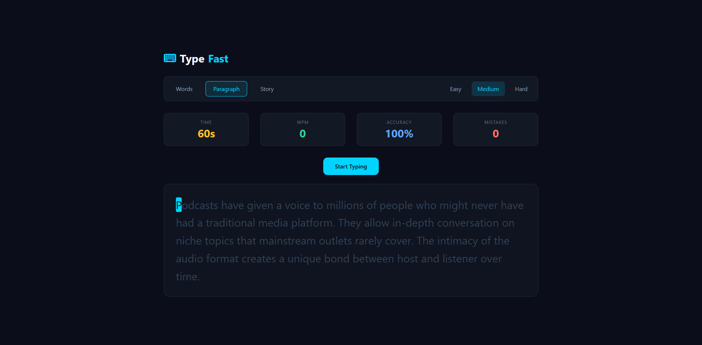
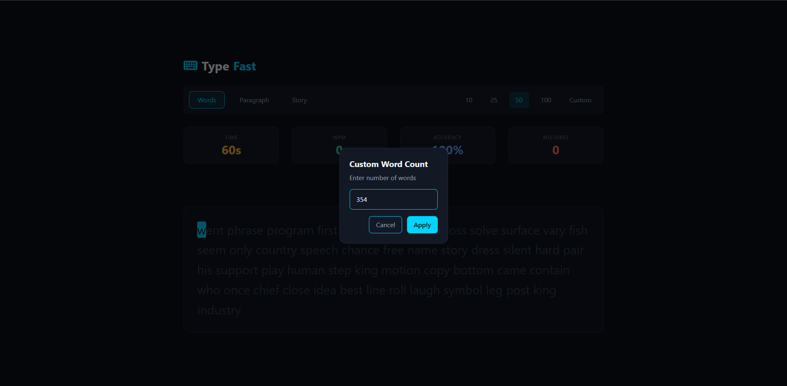
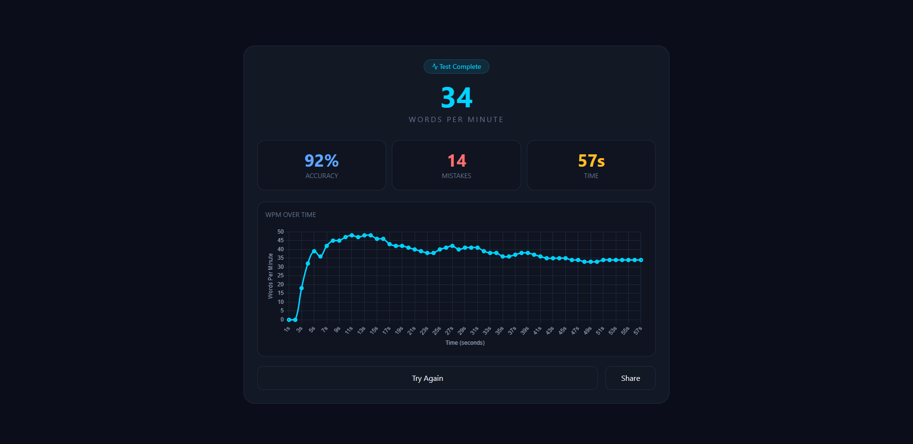

# TypeFast (Typing Speed Tester)

TypeFast is a simple typing speed tester built wiht React. You can practice with random words, paragraph, or stories and see your typing speed, accuracy, mistakes, and time while you type. Pick a mode, start typing and see how fast you actually are.

I built this project to practice React, frontend developmnet, APIs, and backend authentication.

## What it does
* Tests yout typing speed in WPM (words per minute)
* Three typing modes: Words, paragraphs, and Stories
* Choose between 10, 25, 50, 100 or custom number of words
* Custom word count up to 1000 words
* Paragraph mode with esay/ medium/ hard difficulty levels
* Story mode with Horror, Funny , and Adventure categories
* AI-generatd stories using the Gemini API 
* Live WPM, Accuracy, Mistakes, and Time stats
* Pause and resume the typing test
* Custom timer
* WPM history chart after fininshing  a test
* keyborad sound while typing
* Settings for keyboard sound , timer visbility, and cursor style
* Login an signup system
* Password visibility toggle
* JWT-based authentication
* User data stored in MongoDB
* Result screen after completing a test

## Typing Modes
- Words 
    Practice wiht random words
    You can choose:
        10
        25
        50
        100
        custom amount (up to 1000 words)
    This mode is useful when you just want to focus on typing speed.

- Paragraph
    Practice wiht different difficulty levels:
    -- Easy: short sentences, everyday vocabulary
    -- Medium: longer sentences, more complex topics
    -- Hard: academic and technical language philosophy, science, economics
- Story 
    Generates a fresh story using the Gemini AI API every time. Pick horror, funny or adventure. Since its AI generated. you get something different on every attempt.

## Tech used
* React (with hooks)
* Tailwind CSS v4 with custom design tokens
* Chart.js + react-chartjs-2  for the WPM graph
* Google Gemini API for story generation 
* ludide React for icons
* Vite

## Getting started
* git clone https://github.com/meAtmuna/typing-speed-tester.git
* cd typing-speed-tester
* npm install

You need a Gemini API key for the story mode.
Create a .env file in the root:

* VITE_GEMINI_API_KEY = your_api_key_here

You can get a free key at https://aistudio.google.com
Then start the dev server:

* npm run dev

## Screenshot

## Whats coming 
This project still being worked on. Some feature I plan to add:
* Custom timer let the user pick 30, 60 or 120 seconds instead of always 60
* Personal best tracking and leaderboard
* Option to turn the keyboard sound on/off like Settings Option 
* Responsive design
* User authentication (login / signup)
